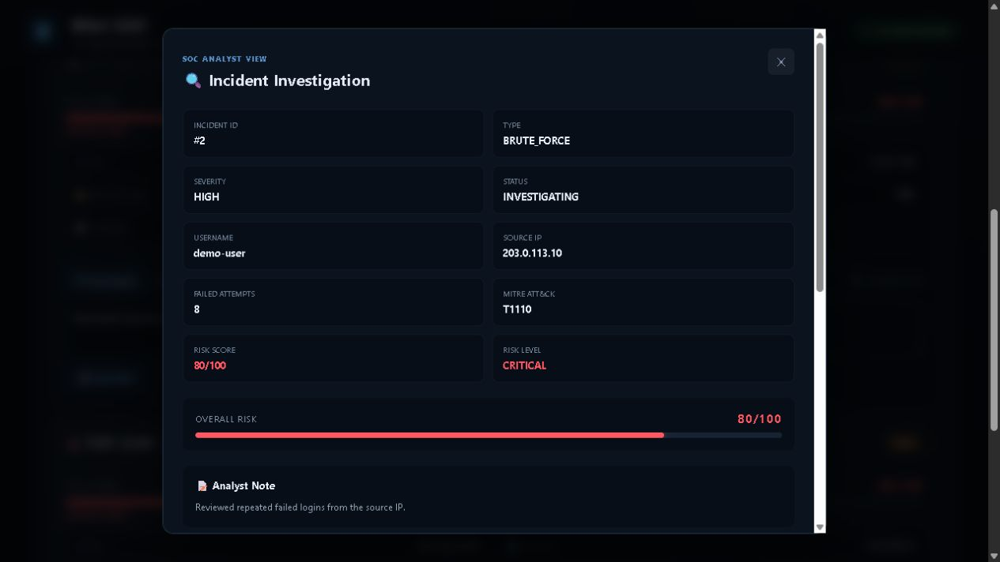

# Mini SOC

Mini SOC is a local Security Operations Center demonstration. It stores synthetic security events in SQLite, detects suspicious activity, correlates alerts into incidents, and exposes the results through FastAPI and a browser dashboard.

[](docs/assets/mini-soc-demo.mp4)

_Select the screenshot to open the 77-second demo video._

## What it demonstrates

- Brute-force detection: 5 or more failed logins in 5 minutes
- Port-scan detection: 10 or more scan events in a rolling 5-minute window
- Account-compromise correlation: repeated failures followed by a successful login
- Time-bounded incident deduplication and persistent monitoring checkpoints
- MITRE ATT&CK mapping and risk scoring
- Incident status, analyst notes, response-action tracking, and audit history
- FastAPI endpoints, interactive API documentation, and a responsive dashboard

The simulators only insert synthetic records into the local database. They do not send network traffic or change accounts, firewalls, endpoints, passwords, or sessions.

## Architecture

```text
Simulator / generator -> SQLite events -> detection and correlation
                                            |
                                            v
Dashboard <- FastAPI <- SQLite incidents, history, and response actions
```

The live monitor stores its last successfully processed event ID in SQLite. Events created while the monitor is offline are processed after restart. If detection fails, the checkpoint is not advanced, so the batch can be retried. On first use, monitoring starts at the database's latest event to avoid unexpectedly rescanning older demo data.

## Tech stack

- Python 3.10+
- FastAPI and Uvicorn
- SQLite
- Plain HTML, CSS, and JavaScript
- Pytest and HTTPX

## Installation

```powershell
git clone <repository-url>
cd mini-soc
python -m venv .venv
.venv\Scripts\Activate.ps1
python -m pip install -e ".[dev]"
```

The database and log directories are created automatically. To use a separate database, set `MINI_SOC_DATABASE` before running a command:

```powershell
$env:MINI_SOC_DATABASE = Join-Path $env:TEMP "mini-soc-demo.db"
```

## Quick demo

Open three PowerShell terminals in the project directory and activate the virtual environment in each one.

Terminal 1 — start the live monitor:

```powershell
python -m src monitor
```

Terminal 2 — start the API and dashboard:

```powershell
python -m src serve
```

Terminal 3 — insert synthetic attack activity:

```powershell
python -m src simulate brute-force --username demo-user --ip 203.0.113.10 --count 8
python -m src simulate port-scan --username scanner --ip 198.51.100.25 --count 15
python -m src simulate account-compromise --username demo-admin --ip 203.0.113.50 --count 5
```

Open <http://127.0.0.1:8000/dashboard>. Investigate an incident, change its status, add an analyst note, complete a simulated response action, and refresh the page to confirm that the timeline persisted. Interactive API documentation is available at <http://127.0.0.1:8000/docs>.

Other supported commands:

```powershell
python -m src detect
python -m src generate --count 50
python -m src --help
```

## Detection and scoring

| Detection | Trigger | MITRE ATT&CK |
| --- | --- | --- |
| Brute Force | 5 failed logins from one user/IP pair within 5 minutes | T1110 |
| Port Scan | 10 scan events from one user/IP pair within 5 minutes | T1046 |
| Account Compromise | 5 failed logins followed by a success within 5 minutes | T1078 |

Risk scores start from the incident severity: Low 25, Medium 50, High 75, and Critical 90. Five or more related attempts add 5 points; ten or more add 10 points. Scores are capped at 100.

## Incident lifecycle

```text
OPEN -> INVESTIGATING -> RESOLVED
```

Analysts can add notes and track six simulated response actions: disable account, reset password, block attacker IP, revoke active sessions, isolate endpoint, and collect evidence. Every status, note, and action change is stored in the incident history. Response actions are case-management records only and can be reopened if marked complete accidentally.

## API

The main routes are `/events`, `/incidents`, `/incidents/{id}`, `/incidents/{id}/history`, `/incidents/{id}/response-actions`, and `/stats`. Patch routes update incident status, analyst notes, and response actions.

## Tests

```powershell
python -m pytest
```

The 19-test suite covers detection windows, correlation, risk scoring, deduplication, persistent checkpoint recovery, API behavior, incident history, and response actions. See [docs/TESTING.md](docs/TESTING.md) for the manual release workflow.

## Known limitations

Mini SOC is a portfolio demonstration, not a production SIEM or SOAR platform. It uses simplified synthetic telemetry and a local SQLite database. Port scans are modeled as events rather than packet captures or destination-port records. The monitor is intended for one process, and the local dashboard/API do not implement authentication or authorization.

## Project layout

```text
frontend/    Dashboard HTML, CSS, and JavaScript
src/         API, storage, detection, monitoring, and simulators
tests/       Automated tests
docs/        Release testing notes and demo assets
data/        Runtime SQLite databases (ignored)
logs/        Runtime event logs (ignored)
```

## License

Licensed under the [MIT License](LICENSE).
